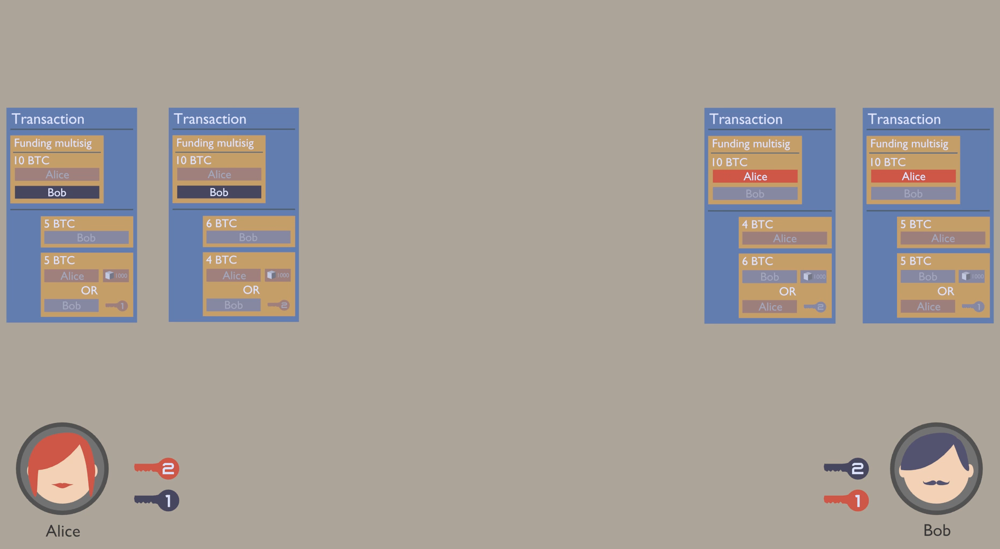
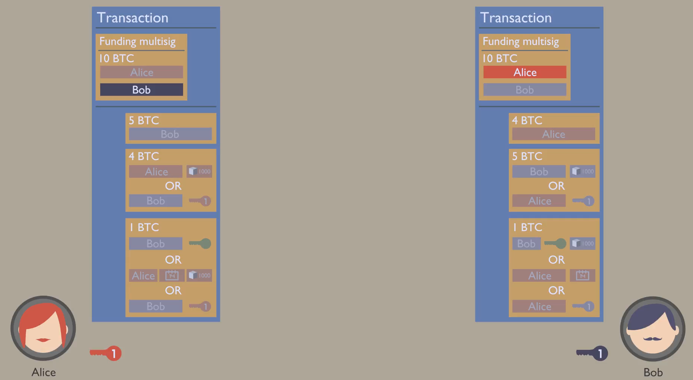

<!-- .slide: class="master01" -->

<!-- section -->
### Workshop: The Lightning Network
Oliver Gugger ([@gugol](https://twitter.com/gugol), [github.com/guggero](https://github.com/guggero)) 

Part of the Lightning Network team at Puzzle ITC
<!-- .slide: class="master02" -->

<!-- section -->
### The current state of Bitcoin (2018-01-30)
 - SegWit is enabled
   
   <small>from: segwit.party/charts/</small>
<!-- .slide: class="master03" -->

<!-- slide -->
### The current state of Bitcoin (2018-01-30)
 - Mempool is emptying
   
   <small>from: blockchain.info/charts/mempool-count</small>
<!-- .slide: class="master04" -->

<!-- slide -->
### The current state of Bitcoin (2018-01-30)
 - Fees are dropping
   
   <small>from: dedi.jochen-hoenicke.de/queue</small>
<!-- .slide: class="master05" -->

<!-- section -->
### Problem?
 - When demand is high, the fees fluctuate even more than price  
   
   <!-- .element width="75%" -->
   <small>from: dedi.jochen-hoenicke.de/queue</small>
<!-- .slide: class="master03" -->

<!-- slide -->
### Problem?
 - Even with SegWit the block size is limited (1'000 vkB, 4'000 kWU)
 - Average transactions per block went up as far as 2'723 (~4.5 tx/s)
 - How do we get to Visa which can process up to 24'000 tx/s at peak?
<!-- .slide: class="master04" -->

<!-- section -->
### Solution?

## Bigger blocks!
Sure, because downloading 5.3 GB every 10 minutes is no problem!
<!-- .slide: class="master03" -->

<!-- slide -->
### Better solution
 - Scale off-chain
 - Add a layer 2
 - For example: The Lightning Network
<!-- .slide: class="master04" -->

<!-- section -->
### The Lightning Network
 - Smart Contracts create Payment Channels
 - Funding transaction is in blockchain
 - Payment Channel updates happen at "speed of light"
<!-- .slide: class="master03" -->

<!-- slide -->
### The Lightning Network
 - Payments can be routed through multiple hops/channels, creating a network
 - Protected by onion routing/multi layer encryption
 - No trust required, cheating made impossible by cryptography
<!-- .slide: class="master04" -->

<!-- slide -->
### The Lightning Network
 - Layer 2 on top of Bitcoin
 - Routing payments like TCP/IP
   
<!-- .slide: class="master05" -->

<!-- slide -->
### Workshop: Task 1
 - Install any Lightning Network wallet for Bitcoin testnet as
   described on [https://gugger.guru/lightning-workshop/](https://gugger.guru/lightning-workshop/)
 - Send yourself some testnet Bitcoin
 - Wait for the balance to be confirmed (usually 3 confirmations)
<!-- .slide: class="master01" -->

<!-- section -->
### How it works
Technologies used:
 - Multisignatures
 - Timelocks
   - CheckLockTimeVerify (absolute)
   - CheckSequenceVerify (relative)
 - Hashlocks
<!-- .slide: class="master01" -->

<!-- slide -->
### How it works

<small>from: https://www.youtube.com/watch?v=7tHD9Gj9UNg</small>
<!-- .slide: class="master02" -->

<!-- slide -->
### How it works

<small>from: https://www.youtube.com/watch?v=7tHD9Gj9UNg</small>
<!-- .slide: class="master03" -->

<!-- slide -->
### How it works

<small>from: https://www.youtube.com/watch?v=7tHD9Gj9UNg</small>
<!-- .slide: class="master04" -->

<!-- slide -->
### How it works

<small>from: https://www.youtube.com/watch?v=7tHD9Gj9UNg</small>
<!-- .slide: class="master05" -->

<!-- slide -->
### How it works

<!-- .element: width="75%" -->

<!-- .element: width="49%" -->

<!-- .element: width="49%" -->
<small>from: https://www.youtube.com/watch?v=k-bXIZOMNyA</small>
<!-- .slide: class="master01" -->

<!-- slide -->
### Workshop: Task 2
 - Open a channel to [lightning-test.puzzle.ch](https://lightning-test.puzzle.ch)
 - Wait for the funding transaction to be confirmed (usually 3 confirmations)
<!-- .slide: class="master03" -->

<!-- section -->
### When will it be ready?

<small>from: https://lnmainnet.gaben.win/</small>
<!-- .slide: class="master04" -->

<!-- slide -->
### How will we use it?

<!-- .slide: class="master05" -->

<!-- slide -->
### How will we use it?

<!-- .slide: class="master01" -->

<!-- slide -->
### Workshop: Task 3
Discussion:  assume Puzzle ITC has a Lightning Network Hub and channels with merchants:
 - What considerations would you make when choosing a Hub?
 - How big of a channel would you want to open?
 - How big would the channels to the merchants need to be?
<!-- .slide: class="master02" -->