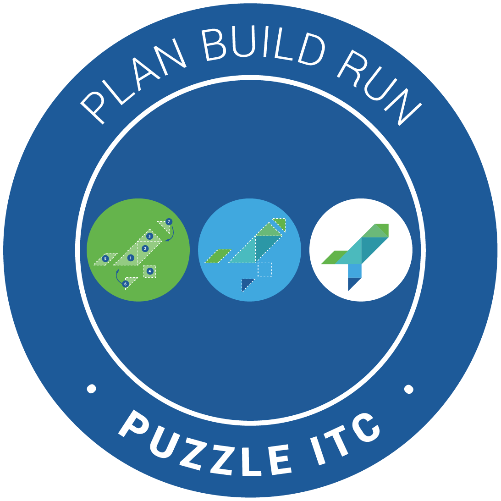
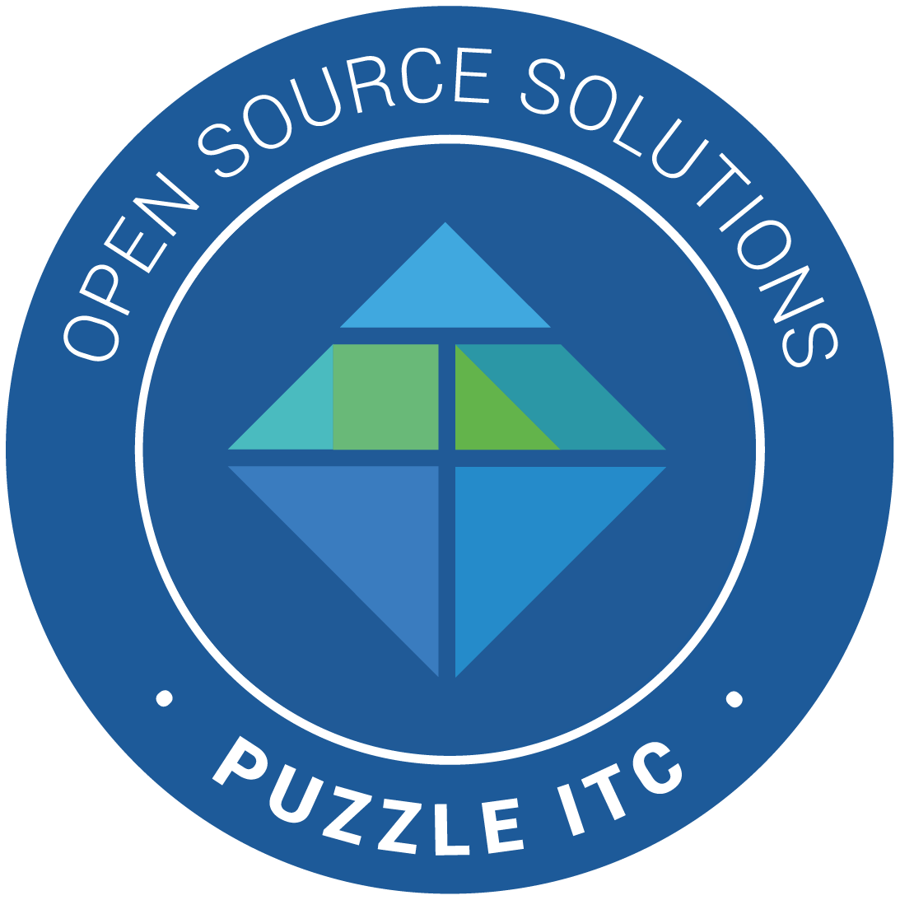
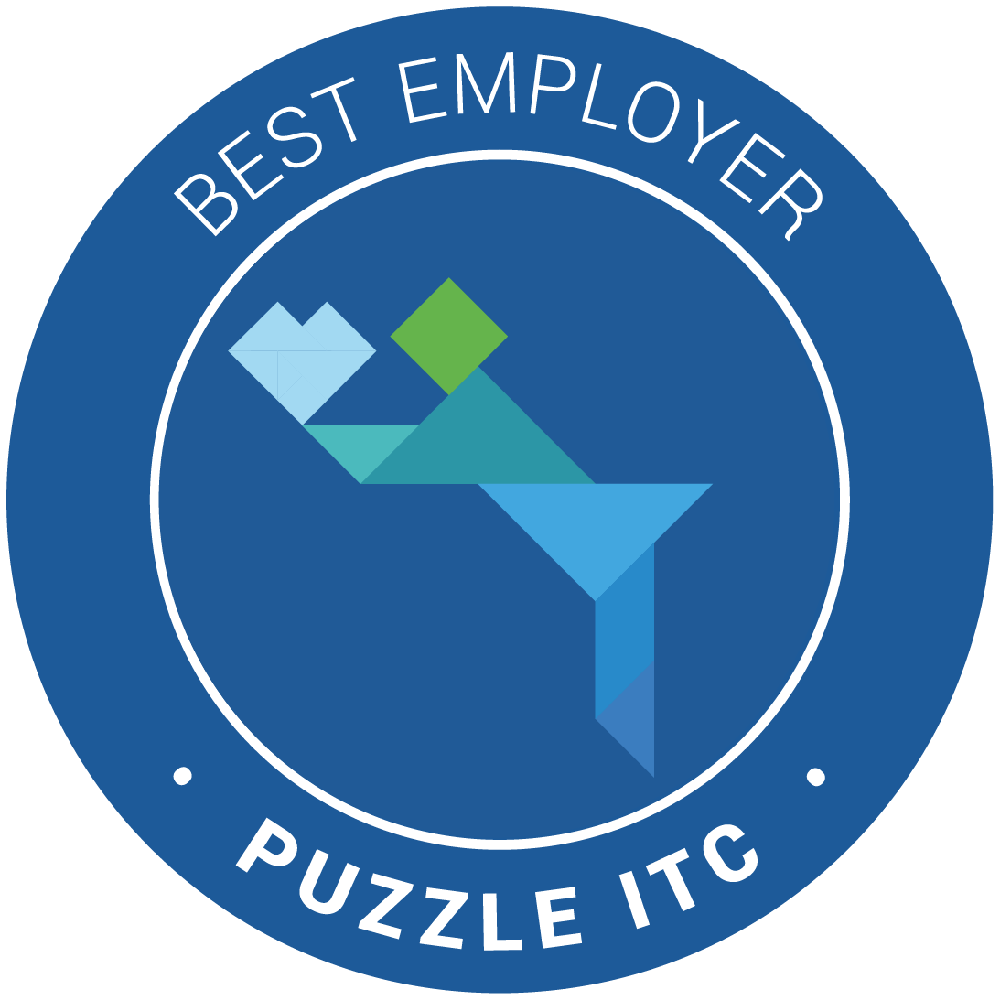
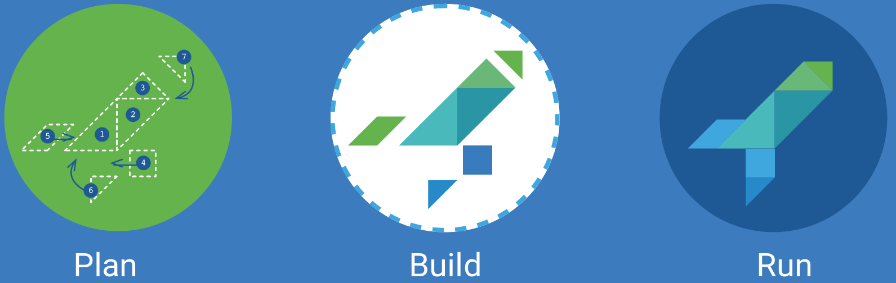
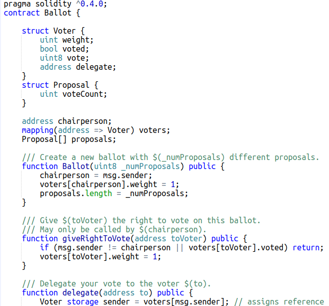
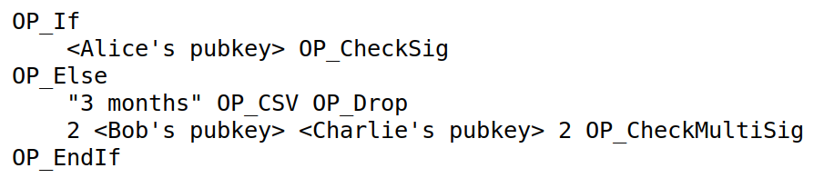

<!-- .slide: class="master01" -->

<!-- section -->
## Smart Contracts /  The Lightning Network
Oliver Gugger, Puzzle ITC 
[@gugol](https://twitter.com/gugol) 
[github.com/guggero](https://github.com/guggero)

<small class="very-small">Disclaimer: Slides are provided for illustrative purposes only and should not be construed as
investment advice or strategy. Do your own research! Vested interest: Author owns Bitcoin and other crypto currencies</small>
<!-- .slide: class="master02" -->

<!-- slide -->
# Agenda
 * About Puzzle ITC
 * Smart Contracts
 * The Lightning Network
 * Trading Basics
 * Workshop: Questions &ndash; Answers
 * Snacks and drinks offered by Puzzle ITC
<!-- .slide: class="master03" -->

<!-- slide -->
one team &ndash; one mission
## Changing IT for the better
       
<!-- .slide: data-background="img/slide-02/01-puzzle-members.png" class="master-blue" -->

<!-- slide -->
<!-- .slide: data-background="img/slide-02/02-puzzle-powerhouse.png" -->

<!-- slide -->
# Puzzle Vision 2020

  
  <small>We cover the whole <b>Life Cycle</b> of business applications</small>

  
  <small>We are <b><i>the</i></b> partner for Open Source solutions</small>

  
  <small>We belong to the best <b>employers</b> in Switzerland</small>

<!-- .slide: class="master02" -->

<!-- slide -->

# Full Service Provider
We support you through the whole IT project
<!-- .slide: class="master02" -->

<!-- slide -->
<!-- .slide: data-background="img/slide-02/05-puzzle-community.png" -->

<!-- slide -->
# News (Feb. 2018)
 * Puzzle created a Lightning Network team
 * Hands-on workshops to the Lightning Network regularly on Meetup  
 * Starting in summer, members can choose to receive part of their salary in Bitcoin
 * We are always looking for talented engineers
<!-- .slide: class="master05" -->

<!-- section -->
# Smart Contracts
 * Scripts on a blockchain
 * Self-executing programs that handle funds
 * Two categories
   * Turing-complete virtual machine (Ethereum, RSK)
   * Turing-incomplete scripts (Bitcoin and forks)
<!-- .slide: class="master01" -->

<!-- slide -->
# Ethereum 1/3
 * Crypto Currency named Ether
 * Pow, block time 14-15sec
 * Turing-complete Ethereum Virtual Machine
   * Called the World Computer
   * Programmed in Solidity or others (Serpent, LLL, Mutan)
   * Every full node runs all the code and has all the state
<!-- .slide: class="master02" -->

<!-- slide -->
# Ethereum 2/3
 * Two types of addresses: User accounts and contract addresses
 * Interact with contract through transaction
 * Contract needs Gas to run
   * Gas limit
   * Gas price (Gwei, "gigawei", or "nanoether")
<!-- .slide: class="master03" -->

<!-- slide -->
# Ethereum 3/3

 * Applications
   * CryptoKitties!
   * ERC20 tokens
   * Dapps

 

<!-- .slide: class="master04" -->

<!-- slide -->
# Bitcoin Script 1/3
 * Forth-like stack-based stateless  Turing-<b>in</b>complete language
 * P2PKH (pay-to-public-key-hash)
   * <small>`OP_DUP OP_HASH160 <PubkeyHash> OP_EQUALVERIFY OP_CHECKSIG`</small>
   * <small>`1GuggerownoWdKkMUA8C2ySkA8AK7Ucn7n`</small>
 * P2SH (pay-to-script-hash)
   * <small>`OP_HASH160 <Hash160(redeemScript)> OP_EQUAL`</small>
   * <small>`3BernH6Kzx4CkgX7A21w2rFQ9Q739BCcCe`</small>
<!-- .slide: class="master05" -->

<!-- slide -->
# Bitcoin Script 2/3
 * Flow control
 * Multisignature
 * Time locks
 * Hash locks

<!-- .slide: class="master01" -->

<!-- slide -->
# Bitcoin Script 3/3
 * Applications
   * Escrow services
   * Payment Channels
   * Atomic cross-chain trading
<!-- .slide: class="master02" -->

<!-- section -->
## The Lightning Network 1/3
 * Smart Contracts create Payment Channels
 * Funding transaction is in blockchain
 * Payment Channel updates happen at "speed of light"
<!-- .slide: class="master03" -->

<!-- slide -->
## The Lightning Network 2/3
 * Payments can be routed through multiple hops/channels, creating a network
 * Protected by onion routing/multi layer encryption
 * No trust required, cheating made impossible by cryptography
<!-- .slide: class="master04" -->

<!-- slide -->
## The Lightning Network 3/3
 * Layer 2 on top of Bitcoin
 * Routing payments like TCP/IP

<!-- .element width="30%" -->

<!-- .element width="50%" -->

 * Hands-on workshop repeated soon
<!-- .slide: class="master05" -->

<!-- slide -->
## Puzzle Lightning Hub Bern
 * First mainnet node in Switzerland, among the first 110 world wide
 * We want to help build the network for Switzerland
 * Build and support the community
 * Approach merchants
 * Pay employees through Lightning
 <!-- .slide: class="master05" -->
 

<!-- slide -->
## Resources
 * Slides: [gugger.guru/lightning-workshop](https://gugger.guru/lightning-workshop)
 * Puzzle Blog: [puzzle.ch/de/blog](https://www.puzzle.ch/de/blog)
 * Lightning Network: [three part video on youtube](https://www.youtube.com/watch?v=XFUYvLW-0oE)
 * testnet node: [lightning-test.puzzle.ch](https://lightning-test.puzzle.ch)
 * Meetup: Stay tuned for next events
<!-- .slide: class="master05" -->