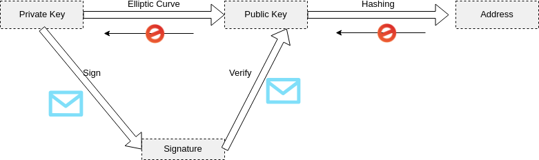

<!-- .slide: class="master01" -->

<!-- section -->
### Bitcoin Cryptography with JavaScript
Oliver Gugger  
<small>Full Stack Engineer at Puzzle ITC 
 github.com/guggero 
 @gugol  
slides: gugger.guru/lightning-workshop/
</small>
<!-- .slide: class="master02" -->

<!-- slide -->
<slide tagcloud shuffle>
  ECC
  block
  asymmetric
  address
  private key
  SHA256
  signature
  merkle tree
  ECDSA
  public key
  transaction
  HMAC
  multi-signature
  RIPEMD160
</slide>
<!-- .slide: class="master03" -->

<!-- slide -->

  Don't worry! This is a high-level overview for engineers and coders.

<!-- .slide: class="master03" -->

<!-- slide -->
### Cryptography Primitives in Bitcoin
 * Elliptic curves (ECC / ECDSA)
 * Hashing (SHA, RIPEMD)
<!-- .slide: class="master04" -->

<!-- slide -->
### Elliptic Curve Cryptography
  
 * Geometry based one-way function
 * Can be used for key exchange (ECDH) and signatures (ECDSA)
 * Shorter key size compared to RSA (256bit ECC ≃ 3072bit RSA)
<!-- .slide: class="master05" -->

<!-- slide -->
### Cryptographic Hashing
 * Collision resistant, constant-size fingerprint
 * SHA256 extensively used in Bitcoin
 * RIPEMD160 as a secondary safety net for addresses
<!-- .slide: class="master01" -->

<!-- slide -->
### Demo: Libraries used
<a href="demos/berner-js/demo.html">Demo</a> 
 * Web Crypto API (browser) 
 * bitcoinjs-lib ([github.com/bitcoinjs/bitcoinjs-lib](https://github.com/bitcoinjs/bitcoinjs-lib))
<!-- .slide: class="master02" -->

<!-- slide -->

<!-- .slide: class="master03" -->

<!-- slide -->
### Security concerns
 * 2256 ≃ 1077 addresses (universe has ~1080 atoms)
 * Bitcoin Mining: ~76bit in 10 minutes
 * Use secure "randomness"
 * Be very careful with browser RNGs!
<!-- .slide: class="master03" -->

<!-- slide -->
### Further topics
 * Hierarchical Deterministic (HD) wallets
 * Merkle Trees
 * HMAC
 * PBKDF2
<!-- .slide: class="master04" -->

<!-- slide -->
### Thank you!
#### Questions?
<!-- .slide: class="master05" -->