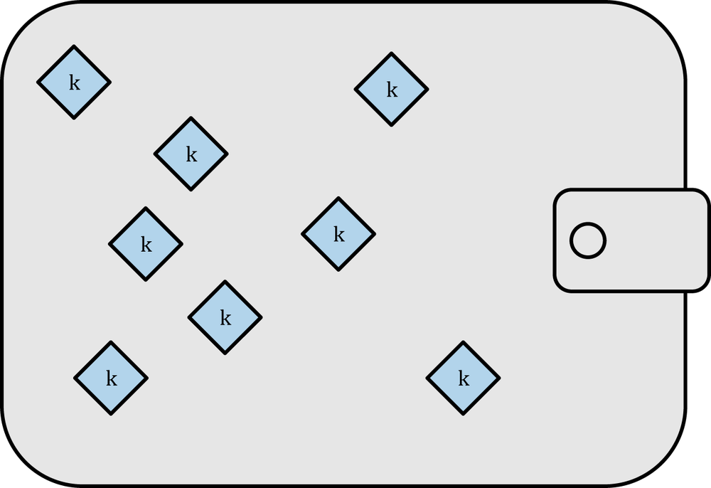
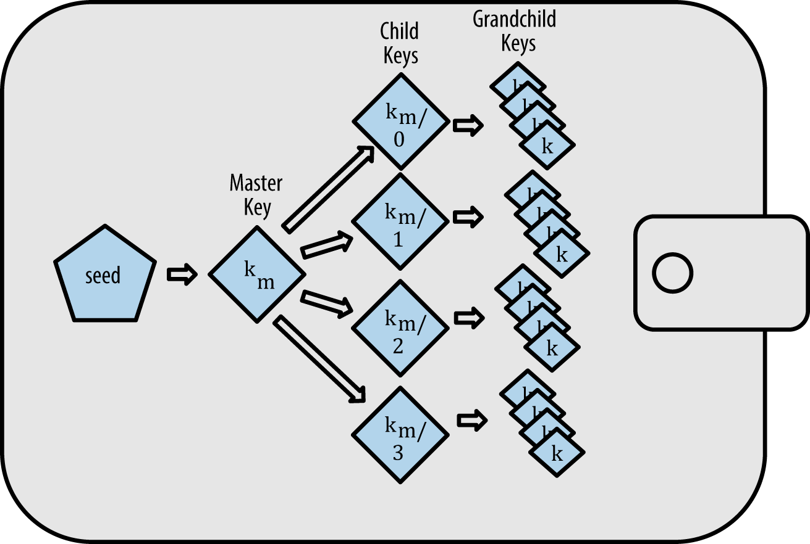

<!-- .slide: class="master01" -->

<!-- section -->
### Bitcoin Addresses
Oliver Gugger  
<small>Full Stack Engineer at Puzzle ITC 
 github.com/guggero 
 @gugol  
slides: https://gugger.guru
</small>
<!-- .slide: class="master02" -->

<!-- slide -->
### What's an address?
 Private key 
 <i class="fa fa-angle-double-down fa-lg"></i> 
 Public key 
 <i class="fa fa-angle-double-down fa-lg"></i> 
 Public key hash 
 <i class="fa fa-angle-double-down fa-lg"></i> 
 Address
<!-- .slide: class="master03" -->

<!-- slide -->
### Example
<pre><code>a9b23dfcef4c91f99ceba1f4a6b41a9d5697752a51c91245fc82241827cb665e</code></pre>
<i class="fa fa-angle-double-down fa-lg"></i> 
<pre><code>02aff13521de73d1fd8825d1dd9f10e2724dcdeb688fccf92a60d2a259cdad9cba</code></pre>
<i class="fa fa-angle-double-down fa-lg"></i> 
<pre><code>008cc0ce803547b6efe4c68524f5d269837e01ea432754e41d</code></pre>
<i class="fa fa-angle-double-down fa-lg"></i> 
<pre><code>1DqEaJDBgpxc8QtETz4b5uMSEkgCbLRacU</code></pre>
<!-- .slide: class="master04" -->

<!-- slide -->
### What's base58?
* Human friendly encoding
* Checksum and version

<pre><code>0x00: 1DqEaJDBgpxc8QtETz4b5uMSEkgCbLRacU</code></pre>
<pre><code>0x05: 3EXFVqhdEjGzDaafb5jBWXiNPGxv9g7zVU</code></pre>
<pre><code>0x30: LY4BqWX1mVCfPDaPe83tMvRCSy3UjnKR5u</code></pre>
<pre><code>0x1e: DHyL7Z9pzErtfR4qCa49dfX37tQVxoLq6g</code></pre>
<pre><code>0x6f: mtMBsMJAVrPruXMrBZ2xupZm6kGuVu6TSZ</code></pre>
<!-- .slide: class="master05" -->

<!-- slide -->
### BIP32
 * Bitcoin Improvement Proposal #32
 * Hierarchical Deterministric Wallets
 * Before / After:

 &nbsp; &nbsp;

 * Ever address has a path: <em>m/0'/0</em>
<!-- .slide: class="master01" -->

<!-- slide -->
### BIP39
 * Mnemonic code for generating deterministic keys 
 * Before:
   <pre><code>183a4aac1355fbdf0f480a6b1714ba7943f315b3d7503b6540542a762404e094
8211f9ca0cf7abc5f084bd0085c9482ed891c29d9a475bf0e5f9e3ccb09a62de</code></pre>
 * After: 
   <pre><code>gospel brown tuition leave damage announce
sphere private timber pole someone artefact</pre></code>
<!-- .slide: class="master02" -->

<!-- slide -->
### BIP44
 * Multi-Account Hierarchy for Deterministic Wallets
 * Every coin gets a number assigned
<pre><code>m / purpose' / coin_type' / account' / change / address_index</code></pre>
 * Example:
<pre><code>m/44'/5'/0'/0/7441</code></pre>

<!-- .slide: class="master03" -->

<!-- slide -->
### Thank you!
#### Questions?
<!-- .slide: class="master05" -->