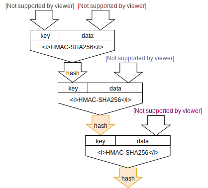

<!-- .slide: class="master01" -->


<!-- section -->
## Barcamp session: Macaroons
Oliver Gugger<br/><br/>
[@gugol](https://twitter.com/gugol)<br/>
[github.com/guggero](https://github.com/guggero)

<!-- .slide: class="master02" -->


<!-- section -->
## Agenda
* What are macaroons?
* How do they work?
* How are they used in LND?
* What features are we working on?
* Questions/discussion
<!-- .slide: class="master03" -->


<!-- slide -->
## What are macaroons?
* "Cookies with Contextual Caveats..."
* Paper from 2019 by Google employees/Brown university students
* https://ai.google/research/pubs/pub41892
   
<!-- .slide: class="master04" -->


<!-- slide -->
## How do they work?
<q>Macaroons are based on a construction that uses nested,
  chained MACs (e.g., HMACs) in a manner that is highly efficient...</q>

<!-- .slide: class="master05" -->


<!-- slide -->
## How do they work?



<!-- .slide: class="master05" -->

<!-- slide -->
## How do they work?


<!-- .slide: class="master05" -->


<!-- slide -->
## How do they work?

<br/>
<a href="https://guggero.github.io/cryptography-toolkit/#!/macaroon">
  Online demo
</a>

<!-- .slide: class="master05" -->


<!-- slide -->
## How do they work?


<!-- .slide: class="master05" -->


<!-- section -->
## How are they used in LND?
* Root Key is stored in `macaroons.db`
* Identifier contains nonce and read/write permissions
* Location is always `lnd`


<!-- .slide: class="master01" -->

<!-- section -->
## How are they used in LND?
* Supported caveat conditions:
   * `time-before <utc-timestamp>`
   * `ipaddr <client-ip-address>`
* Can be declared with `lncli` parameters

```
--macaroontimeout <in seconds, default 60>
--macaroonip <ip-address, default not set>
```

<!-- .slide: class="master01" -->