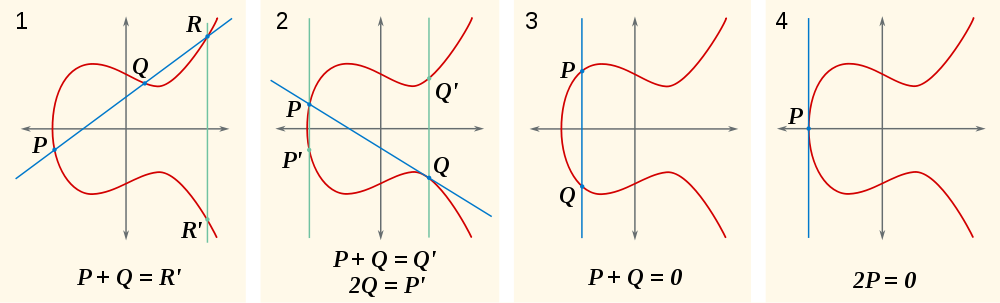
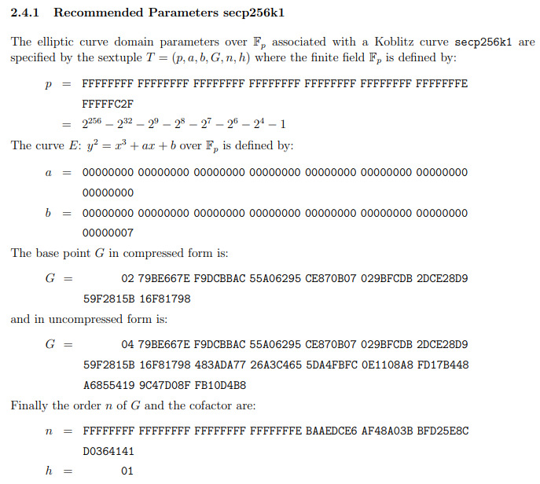

<!-- .slide: class="master01" -->

<!-- section -->
## Elliptische Kurven
Oliver Gugger, Puzzle ITC  
[@gugol](https://twitter.com/gugol) 
[github.com/guggero](https://github.com/guggero)
  
Folien auf [guggero.github.io](https://guggero.github.io)  
<small>Folien basierend auf den Vorlesungen von Christoph Paar:
<a href="https://www.youtube.com/channel/UC1usFRN4LCMcfIV7UjHNuQg/videos">https://www.youtube.com/channel/UC1usFRN4LCMcfIV7UjHNuQg/videos</a>
</small>

<!-- .slide: class="master02" -->

<!-- section -->
## Agenda
* Was sind Gruppen?
* Beispiel in <code class="inline">$$ \mathbb{Z}^*_{11} $$</code>
* Was sind Körper?
* Geometrische Interpretation der Elliptischen Kurven
* Kryptografie mit Elliptischen Kurven
* Rechenbeispiel
* Anwendungen

<!-- .slide: class="master03" -->

<!-- slide -->
## Was sind Gruppen?
* Werden verwendet um Rechnen mit konkreten Zahlen zu abstrahieren, sprich rechnen mit Symbolen statt Zahlen
* Zutaten: Paar aus Menge `G` und Operation,  z.B.`*` oder `+`
* Beispiel: <code class="inline">$$ (\mathbb{Z}, *) $$</code>

<!-- .slide: class="master05" -->

<!-- slide -->
## Was sind Gruppen?
* Abgeschlossenheit: Für alle GE a und b gilt:  `$$ (a ∗ b) ∈ G $$`
* Assoziativität: Für alle GE a, b und c gilt:  `$$ (a ∗ b) ∗ c = a ∗ (b ∗ c) $$`

<!-- .slide: class="master05" -->

<!-- slide -->
## Was sind Gruppen?
* Neutrales Element: Es gibt ein neutrales Element `e ∈ G`, mit dem für alle GE a gilt: 
  `$$ a ∗ e = e ∗ a = a $$`
* Inverses Element: Zu jedem GE a existiert ein Element  
  <code class="inline">$$ a^{-1} ∈ G $$</code> mit <code class="inline">$$ a∗a^{-1} = a^{-1} ∗ a = e $$</code> 

<!-- .slide: class="master05" -->

<!-- slide -->
## Was sind Gruppen?

* Gruppe `(G, *)` heisst *abelsch* oder *kommutativ* wenn Operation `*` symmetrisch ist.
* Kommutativität: Für alle GE a und b gilt  `$$ a ∗ b = b ∗ a $$`
* Mächtigkeit (Kardinalität) `|G|` der Gruppe nennt man Ordnung der Gruppe

<!-- .slide: class="master05" -->

<!-- slide -->
## Beispiel in modulo 11

* <code class="inline">$$ \mathbb{Z}^*_{11} = \\{ 1, 2, 3, 4, 5, 6, 7, 8, 9, 10 \\} $$</code>
* <code class="inline">$$ (\mathbb{Z}^*_{11}, *) $$</code> ist eine abelsche Gruppe `mod 11`
* <code class="inline">$$ |\mathbb{Z}^*_{11}| = 10 $$</code>

<!-- .slide: class="master05" -->

<!-- slide -->
`$$ a = 3 $$`

`$$ a^1 = 3 \pmod{11} \equiv 3 $$`
`$$ a^2 = a * 3 \pmod{11} \equiv 9 $$`
`$$ a^3 = a^2 * 3 \pmod{11} \equiv 5 $$`
`$$ a^4 = a^3 * 3 \pmod{11} \equiv 4 $$`
`$$ a^5 = a^4 * 3 \pmod{11} \equiv 1 $$`
`$$ a^6 = a^5 * 3 \pmod{11} \equiv 3 $$`

<!-- .slide: class="master05" -->

<!-- slide -->
`$$ a = 2 $$`

`$$ a^1 = 2 \pmod{11} \equiv 2 $$`
`$$ a^2 = a * 2 \pmod{11} \equiv 4 $$`
`$$ a^3 = a^2 * 2 \pmod{11} \equiv 8 $$`
`$$ a^4 = a^3 * 2 \pmod{11} \equiv 5 $$`
`$$ a^5 = a^4 * 2 \pmod{11} \equiv 10 $$`
`$$ a^6 = a^5 * 2 \pmod{11} \equiv 9 $$`

<!-- .slide: class="master05" -->

<!-- slide -->
`$$ a = 2 $$`

`$$ a^7 = a^6 * 2 \pmod{11} \equiv 7 $$`
`$$ a^8 = a^7 * 2 \pmod{11} \equiv 3 $$`
`$$ a^9 = a^8 * 2 \pmod{11} \equiv 6 $$`
`$$ a^{10} = a^9 * 2 \pmod{11} \equiv 1 $$`

<!-- .slide: class="master05" -->

<!-- slide -->
## Was sind Körper?

Ein Körper ist ein Tripel `(K, +, *)` aus Menge `K` und Operationen `+` und `*`:
* `(K, +)` ist eine abelsche Gruppe,
* `(K\{0}, *)` ist eine abelsche Gruppe

<!-- .slide: class="master05" -->

<!-- slide -->
## Was sind Körper?

* Die Distributivgesetze
  <code class="inline">$$ a * (b + c) = a * b + a * c $$</code>  und 
  <code class="inline">$$ (a + b) * c = a * c + b * c $$</code>  
  sind für alle <code class="inline">$$ a,b,c ϵ K $$</code> erfüllt.

<!-- .slide: class="master05" -->

<!-- slide -->
## Was sind Körper?

* Beispiel: <code class="inline">$$ (\mathbb{Q}, +, *) $$</code>  ist ein Körper
* Elliptische Kurven bilden einen Körper

<!-- .slide: class="master05" -->

<!-- section -->
## Geometrische Interpretation

<!-- .slide: class="master04" -->

<!-- slide -->
## Kryptografie

* Rechnen mit Kurven im Feld <code class="inline">$$ \mathbb{Z}^*_p \bmod n $$</code>
* Keine direkte geometrische Darstellung mehr, aber Regeln bleiben bestehen
* Generatorpunkt `G`, privater Schlüssel `k`
* Öffentlicher Schlüssel ist Punkt `k * G` oder auch <code class="inline">$$ G^k $$</code>

<!-- .slide: class="master03" -->

<!-- slide -->
## Kryptografie

* Discrete Logarithm Problem (DLP)
* `k * G` ist einfach, dank `double-and-add`-Algorithmus
* Umgekehrte Richtung ist schwer
* Primzahlfelder angreifbar über "Index Calculus"-Methode
* "Gute" elliptische Kurven nicht angreifbar, deshalb viel kleinere Zahlen (256bit ECC ~= 3072bit RSA)

<!-- .slide: class="master03" -->

<!-- slide -->
## Kryptografie

* NIST hat SEC-Kurven definiert und publiziert
* Beispiel: `secp256k1` für 256bit ECC (Bitcoin)

<!-- .slide: class="master03" -->

<!-- slide -->
## Rechenbeispiel

Live-Demo mit <a href="https://guggero.github.io/cryptography-toolkit">guggero.github.io/cryptography-toolkit</a>
<!-- .slide: class="master03" -->

<!-- slide -->
## Anwendungen

* Diffie-Hellman (Schlüsselaustausch)
* ECDSA (Signaturen)
* Schnorr (Signaturen)
* Verschlüsselung möglich (ECES) aber selten verwendet

<!-- .slide: class="master03" -->

<!-- section -->
## Fragen?

<!-- .slide: class="master01" -->